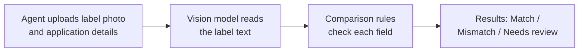

# TTB Label Check

**Live app:** https://ttb-label-check-dot.streamlit.app · **Project page:** https://sinmi-hub.github.io/ttb-label-check/

## What it does

TTB Label Check helps a compliance agent check whether an alcohol label matches its application. The agent uploads a photo of the label and enters what the application says. The app shows, field by field, whether the label matches:

- Brand name
- Class/type
- Alcohol content
- Net contents
- Bottler name and address
- Country of origin (imports)
- The Government Health Warning: word for word, with "GOVERNMENT WARNING:" in capital letters and bold

Each field is marked **Match**, **Mismatch** or **Needs review**, with a one-line reason. Batch mode checks many labels at once from a spreadsheet of application details and returns a downloadable results table.

## How it works



1. **Reading the label.** A vision AI model (Claude) reads the label and returns each field exactly as printed. It also reports whether the warning heading is in capitals and bold.
2. **Checking the fields.** Plain, tested rules make every decision, not the AI:
   - Names ignore capitalization and punctuation, so "STONE'S THROW" matches "Stone's Throw".
   - Alcohol content and net contents are compared as numbers, so "750 mL" matches "0.75 L".
   - The warning must match the required text word for word.
3. **When unsure, it says so.** If text is unreadable or nearly matches, the field is marked Needs review rather than guessed.

## Infrastructure

- **App:** Python with Streamlit, hosted free on Streamlit Community Cloud. If nobody has used it for about 12 hours it goes to sleep; the first visitor clicks a button to wake it, which takes under a minute.
- **Project page:** a static page on GitHub Pages that links to the app.
- **Label reading:** Anthropic's Claude API. The API key is stored as an environment variable on the host and never in the code.
- **Storage:** none. Images and results are kept only for the current session.

## Run locally

Requires [uv](https://docs.astral.sh/uv/) and an Anthropic API key.

```bash
git clone <repo-url> && cd ttb-label-check
export ANTHROPIC_API_KEY=your-key
uv run streamlit run app.py
```

Run the tests:

```bash
uv run pytest
```

Sample labels and a matching batch spreadsheet are in `samples/`.

## Approach and trade-offs

- **AI reads, rules decide.** A vision model only transcribes the label. Plain, tested code makes every match decision, so results are consistent and explainable.
- **Speed.** The label is read as soon as it's uploaded (about 4 seconds), usually while the agent is still typing, so Check label is instant.
- **Judgment where it's safe.** Names ignore case and punctuation; numbers are compared as numbers; the government warning stays strict. Anything uncertain is marked Needs review, not guessed.
- **Trade-off: outside AI service.** TTB's network blocks many outside services. This prototype calls Anthropic's API; in production the reading step could move to an approved or self-hosted model without changing the rules or screens.
- **Trade-off: bold detection.** Whether the heading is bold is the model's visual judgment, so it's less certain than the text checks.
- **Assumptions.** Application details are typed in or uploaded as a spreadsheet (no COLA integration, as requested). Nothing is stored.
